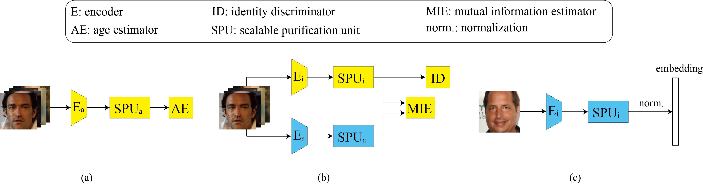

# IEFP
This repo is the official implementation of our paper entitled "Implicit and Explicit Feature Purification for Age-invariant Facial Representation Learning"

## Requirements
- Pytorch >= 1.1
- Python >= 3.7
- CUDA enabled computing device

## Usage
### Download face datasts for evaluation
Please download the following four processed face datasets for evaluation purposes. They include: [morph2](https://drive.google.com/file/d/1P6bEBCax0P7GcfwGlZu4aFpioX16cZI9/view?usp=sharing), [FGNET](https://drive.google.com/file/d/1A2MHRUkNlIk5l7grDRY84vZ8egT4UGXN/view?usp=sharing), [CACDVS](https://drive.google.com/file/d/1XldmKL8s8_nR5Owxdcrq5ZGM0PJiP-_s/view?usp=sharing) and [CALFW](https://drive.google.com/file/d/1nuW8g2irSJFFrOG32_J3xRaOXZxHe62R/view?usp=sharing). All of them should be unziped and then put in the folder named "face_dataset". In addition, regarding the downed CACDVS and CALFW, they need to be combined with correponding txt file to form a new subfolder which is named accordingly. Please refer to the [meta.py](meta.py) for more details.

### Prepare face datasts for model training
1. You can use [MS1MV3](https://github.com/deepinsight/insightface/tree/master/recognition/_datasets_) (i.e. MS1M-RetinaFace on the webpage) or other desired face datasets as the training set. Before the normal network learning, some preprocessing need to be done to those traning samples.
2. The image name needs to be changed. For example, the original name of an image is 05179510.jpg, then the renewed name shoud be 05179510_age_39.jpg.
3. You should emply well-performed age prediction model to infer the choronological age for the training image samlple if the dataset itself provides no age information.

### Download the pretained models
1. Pretained [age estimation branch](https://drive.google.com/file/d/1h77KtVKgoUdOtErBWRhdb4gdgZUCOtgd/view?usp=sharing). Put it in the folder "pretrained_age_estimation_models".
2. [IEFP model](https://drive.google.com/file/d/14ja6v_0ZkgcCtUYDSvTwJX2c2Z8oVkEW/view?usp=sharing) trained on MS1MV3 dataset. Put it in the folder "pretrained_IEFP_models".

### training and testing
1. You can refer to [train.py](train.py) and [test.py](test.py)
2. You can check the performance of IEFP model on four benchmaks by running [test.sh](test.sh)
